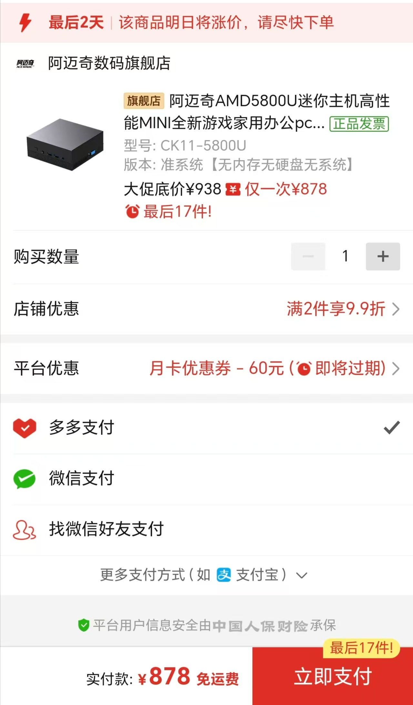
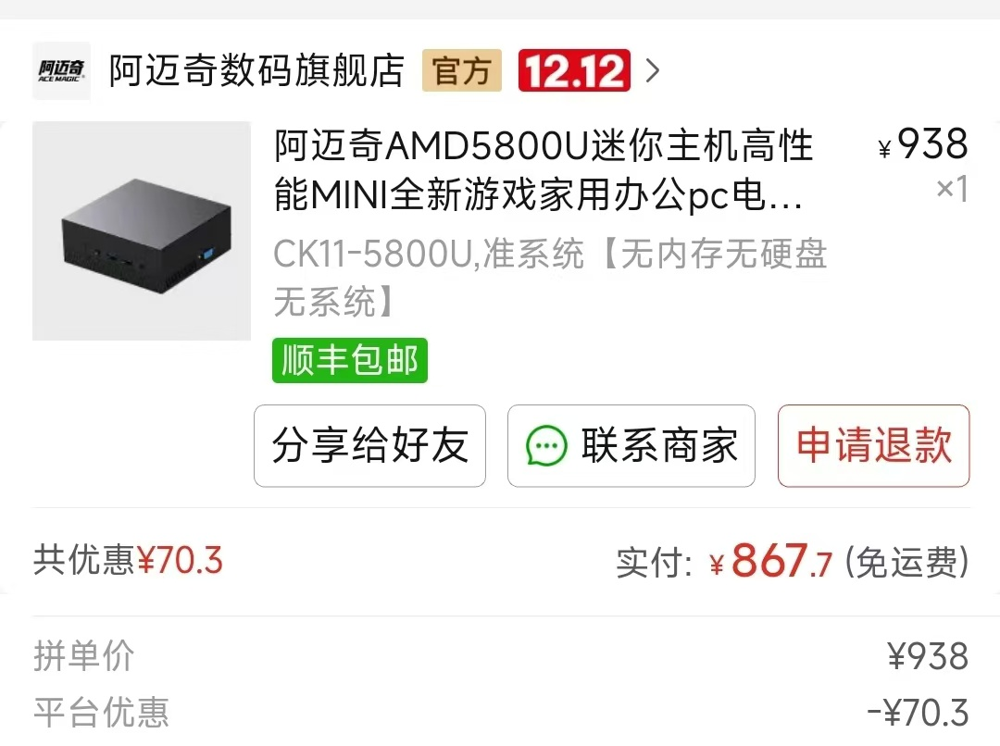

# acemagic-ck11-Hackintosh
acemagic-ck11-Hackintosh

## 电脑配置

|       规格        |                   详细信息                    |
|:---------------:|:-----------------------------------------:|
|      电脑型号       |               acemagic-ck11               |
|      操作系统       |              macOS `Sonoma`               |
|       处理器       |          AMD 锐龙 R7-5800U 8核16线程           |
|       内存        |         4 GB DDR4 2400MHz （免费拿的）          |
|   硬盘1 (SATA)    |  MICRON 1300 M.2 2280 SSD 512GB （149买的）   |
| 硬盘2 (SATA/NVME) |            无（计划接下来放一个Windows的）            |
|       硬盘3       |             可接SATA 2.5寸硬盘/SSD             |
|       核显        |  Radeon Vega Graphics  |
|       显示器       |                     无                     |
|       声卡        |             USB Audio Device              |
|      无线网卡       | m.2 NGFF插槽，默认出厂为 `RTL 8852BE` 已更换为`AX210` |
|      有线网卡1      |                 RTL 8111                  |

# 购买经历

2024年11月26日下单

# 感谢

基于项目 [minisforum-UM590-UM580D-Hackintosh](https://github.com/daliansky/minisforum-UM590-UM580D-Hackintosh.git)

感谢大佬的付出。

# 存在问题

HDMI无声音，能输出画面